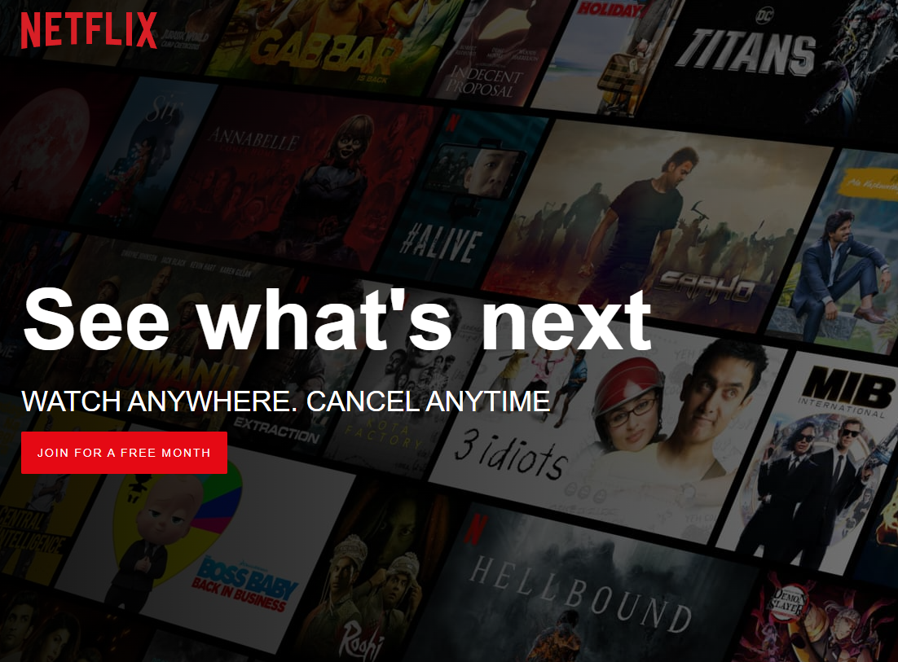

# Netflix Clone  - Front-end
A clone of the Netflix homepage using JavaScript HTM and CSS.
_________________________________________________________________
## Technologies used:

* JavaScript

* HTML

* CSS

## Getting Started:
Navigate to the deployed site using the link below:

* https://thisiserm.github.io/Netflix-Clone/
_________________________________________________________________

## Screenshots:

This is what the app looks like:
### homepage

### features

## V2 User Stories
* AAU, I want to be able to log in and out.
* AAU, I want to be able to access movie & TV show information.

_________________________________________________________________
## V3 User Stories
* AAU, I want to stream content.
_________________________________________________________________

